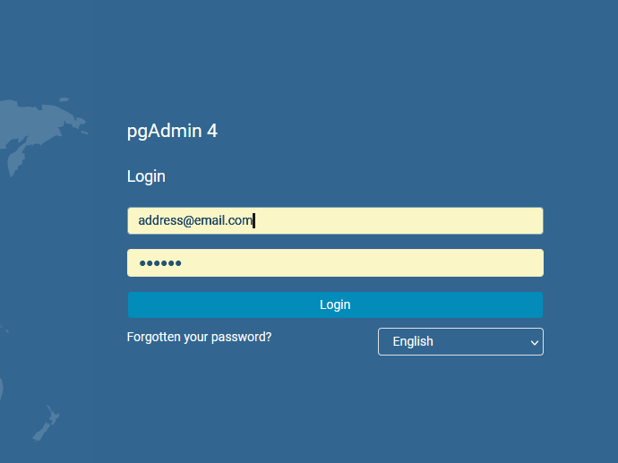
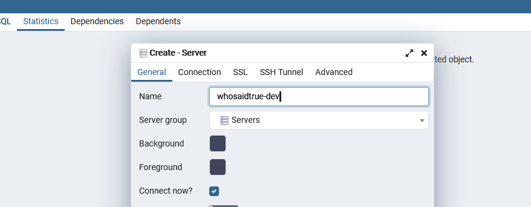

# Getting started with **Who Said True?!**

This project was generated using [Nx](https://nx.dev).

<p style="text-align: center;"></p>

## Prerequisites

For this project you'll need [Docker Desktop](https://www.docker.com/products/docker-desktop), Yarn, and Nx CLI installed globally.

```properties
npm install -g yarn
```

```properties
yarn global add @nrwl/cli
```

## Local Environment Setup

After cloning the repository to your machine, follow the next 6 steps for getting **Who Said True?!** running locally.

### Step 1 - Install Dependencies

```properties
yarn install
```

### Step 2 - Setup Local Environment Variables
Copy the contents from `.template.local.env` and add them to a newly created file at the root of the project named `.local.env` - notice that this file is automatically ignored and will not be shared or included in the repository.

In order for Stripe elements to be visible, the app must be served over HTTPS, even in local development.

To create and install localhost cert and key files, use `mkcert`. If you are using macOS us [this link](https://geekflare.com/local-dev-environment-ssl/) as a guide that goes over the process of generating the files. If you are using Windows use [this link](https://medium.com/@aweber01/locally-trusted-development-certificates-with-mkcert-and-iis-e09410d92031).

Generate a cert and keyfile with the name `localhost` (your generated files should be named `localhost-key.pem` and `localhost.pem`) and add them to the root of the project - notice that these files are automatically ignored and will not be shared or included in the repository.

Replace the `DEV_SSL_KEY` and `DEV_SSL_CERT` values in `.local.env` as follows:

```
DEV_SSL_KEY=localhost-key.pem
DEV_SSL_CERT=localhost.pem
```

### Step 3 - Docker Compose
In order to easily run Redis and PostgreSQL locally you'll need to start up the docker services defined in `docker-compose.yml`. With Docker Desktop installed you can now start the containers in detached mode with the following command:

```properties
docker compose up -d
```

If you need to stop and remove the containers for whatever reason you can run:

```properties
docker compose down
```

### Step 4 - Setup Database Server

With the Docker containers running, open your browser and navigate to `localhost:8080`.

There, enter the credentials listed in `docker-compose.yml`:

- **email**: address@email.com
- **password**: secret



Once you get in, click on `Object > Create > Server`.

Here, you can create a connection to the Postgres container. In the `General` tab, give the server a name.



Then, in the `Connection` tab, enter the information for the database you are working on. For development, make sure these match the values in the `docker-compose.yml` file.

- **Host Name**: postgres (this is the network address of the Postgres container)
- **Port**: 5432
- **Username**: postgres
- **Password**: password


Click "Save" to create the database server.

### Step 5 - Build and Seed Database

Run the following commands in order:

```properties
nx build database
```

```properties
yarn migrate-dev:up
```

```properties
yarn seed-dev
```

### Step 6 - Start Your Engines!

Run the following commands in separate terminal tabs/windows:

```properties
nx serve api
```

```properties
nx serve socket-server
```

```properties
nx serve csr-frontend
```

**Who Said True?!** should now be running and accessible at `https://localhost:4200/`

# Additional Documentation

## API

[API README](apps/api/README.md)

## Socket Server

[Socket Server README](apps/socket-server/README.md)

## Database

[Database README](apps/database/README.md)

## Applications

Each component is split into its own application. Applications are located in the `/apps` directory.

## Libraries

Anything potentially re-usable is placed in a library, and imported into applications. These are located in the `/libs` directory.

## Apple Pay

Apple Pay prevents use from unverified domains, even for local testing. In order to test Apple Pay, or make it available in production, follow the instructions detailed [here](https://stripe.com/docs/stripe-js/elements/payment-request-button).

## Redis

Both the socket server and the API use Redis

The docker compose file includes Redis Insight, an in browser redis management tool.

To access it, navigate to `localhost:8001`. There you will be asked to accept the EULA. Do so.
After accepting the EULA, you will be asked configure redis. Select the option to connect to a database using hostname and password.
There, you can enter the credentials for the Redis instance:

```shell
  Host: redis
  Port: 6379
  Name: wst (this can be whatever you want. It's only used to identify the DB in the Insight GUI)
  Username: (leave blank)
  Password: (leave blank)
```

when prompted.

# Nx Commands

## Generate an application

Run `nx g @nrwl/react:app my-app` to generate an application.

> You can use any of the plugins above to generate applications as well.

When using Nx, you can create multiple applications and libraries in the same workspace.

## Generate a library

Run `nx g @nrwl/react:lib my-lib` to generate a library.

> You can also use any of the plugins above to generate libraries as well.

Libraries are shareable across libraries and applications. They can be imported from `@whosaidtrue/mylib`.

## Running unit tests

Run `nx test my-app` to execute the unit tests via [Jest](https://jestjs.io).

Run `nx affected:test` to execute the unit tests affected by a change.

## Running end-to-end tests

Run `ng e2e my-app` to execute the end-to-end tests via [Cypress](https://www.cypress.io).

Run `nx affected:e2e` to execute the end-to-end tests affected by a change.

## Understand your workspace

Run `nx dep-graph` to see a diagram of the dependencies of your projects.

## Further help

Visit the [Nx Documentation](https://nx.dev) to learn more.
