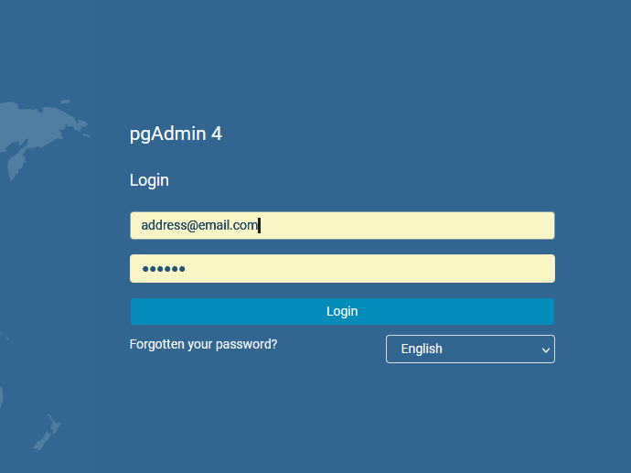
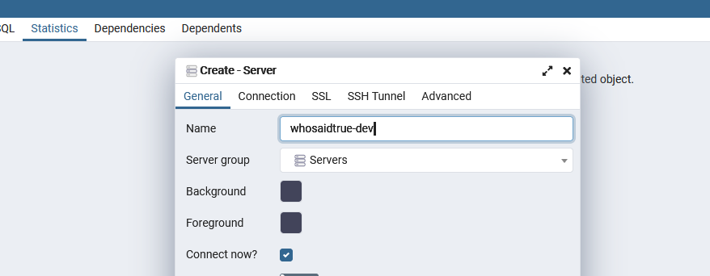
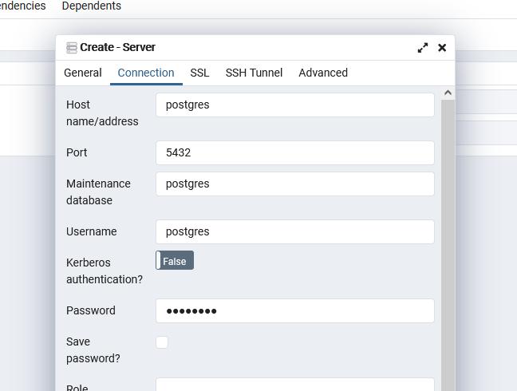

# DATABASE

This directory contains the migrations and seeds, both for production and development environments.

## Table of Contents

----

- [node-pg-migrate](#node-pg-migrate)

- [Development and Production](#development-and-production)

- [Running the Migrations](#running-the-migrations)

- [Reversing the Migrations](#running-the-migrations)

- [Migrations and the Environment](#migrations-and-the-environment)

- [Creating New Migrations](#creating-new-migrations)

- [Running Postgres and PG-Admin](#running-postgresql-and-pg-admin)

- [Connecting to PG-Admin](#connecting-to-pg-admin)

- [Tables](#tables)

- [Custom Types](#custom-types)

- [Functions](#functions)

- [Triggers](#triggers)

- [Indexes](#indexes)

- [Extensions](#extenstions)

- [Views](#views)

- [Running a .sql file](#running-a-sql-file)

- [Seeding data in development](#seeding-data-in-development)

## node-pg-migrate

----

The migrations are generated and run by `node-pg-migrate`. This library provides a Typescript wrapper for database management commands, amd maintains a table that stores a history of the migrations that have been applied.

Complete documentation for `node-pg-migrate` can be found [here](https://salsita.github.io/node-pg-migrate/)

## Creating New Migrations

 ----

To create a new migration in the `migrations/development` directory, run
`yarn migrate-dev:create YOUR_MIGRATION_NAME`.

## Development and Production

----
Separate directories have been created to store development and production migrations. The purpose of this is to prevent unfinished migrations from mixing with production migrations. A migration file should only be copied into the production directory once it is finished and ready to be run. Ideally, once a migration is copied into the production directory, it should never be changed again, unless it is completely reversed and deleted.

## Running the migrations

----

An npm script has been added to make it easy to run all migrations in development. To run the migrations locally, run `docker-compose up` to start the database containers. Once the database is up, run `yarn migrate-dev:up` to run all the migrations located in the `./migrations` directory.

## Reversing the migrations

----

An npm script has been added to reveres **the last** migration applied. Run `yarn migrate-dev:down` to reverse the most recent migration in the `./migrations` directory. Running the command again will delete the migration after that, progressing in reverse chronological order.

## Migrations and the environment

----
The npm migration scripts use the `.local.env` file at the root of the monorepo to retrieve the DATABASE_URL variable. This is the connection string it uses to run the migrations.
If the credentials in this string do not match the credentials in the database, the migrations will fail.

## Running Postgresql and PG-Admin in development

----

A docker-compose file is included at the root of the monorepo for running the database in development. To start the database, run `docker-compose up` from the root of the monorepo.

This will start a Postgresql container and bind it to port 5432 on the host. Make sure that port is free before starting the application.

The docker compose file will also start a pgadmin container, and bind it to port 8080 on the host.

## Connecting to PG-Admin

----
Open your browser and navigate to `localhost:8080`.

There, enter the credentials listed in `docker-compose.yml`:

- **email**: address@email.com
- **password**: secret



Once you get in, click on `Object > Create > Server`.

Here, you can create a connection to the Postgres container. In the `General` tab, give the server a name.



Then, in the `Connection` tab, enter the information for the database you are working on. For development, make sure these match the values in the `docker-compose.yml` file.

- **Host Name**: postgres (this is the network address of the Postgres container)
- **Port**: 5432
- **Username**: postgres
- **Password**: password



Here you can see everything that is going on in the database.

## Tables

----

The following is a comprehensive list of the current list of tables in the Database:

### **users**

| Column Name | Type | Can Be Null | Unique | Default | Reference | On Delete Reference
---| --- | --- | --- | --- | --- | ---
id | integer | no | yes
email | varchar(1000) | no | yes
password | varchar(1000) | yes | no
roles | user_role[] | no | no |
question_deck_credits | smallint | no | no | 0
test_account | boolean | no | no | false
notifiactions | boolean | no | no | false
created_at | timestamptz | no | no | now()
updated_at | timestamptz | no | no | now()

### **decks**

| Column Name | Type | Can Be Null | Unique | Default | Reference | On Delete Reference
---| --- | --- | --- | --- | --- | ---
id | integer | no | yes
name | varchar(1000) | no | yes
sort_order | smallint | no | no
clean | boolean | no | no
age_rating | smallint | no | no
movie_rating | varchar(50) | no | no
sfw | boolean | no | no
status | deck_status | no | no
description | text | no | no
purchase_price | money | no | no
example_question | text | no | no
thumbnail_url | varchar(1000) | no | no
created_at | timestamptz | no | no | now()
updated_at | timestamptz | no | no | now()

### **games**

| Column Name | Type | Can Be Null | Unique | Default | Reference | On Delete Reference
---| --- | --- | --- | --- | --- | ---
id | integer | no | yes
access_code | varchar(10) | yes | yes
status | varchar(100) | no | no
total_questions | smallint | no | no | 0
current_question_index | smallint | no | no | 1
host_player_name | varchar(200) | yes | no
host_id | integer | yes | no | | users | SET NULL
deck_id | integer | no | no | | decks | SET NULL
start_date | timestamptz | yes | no
end_date | timestamptz | yes | no
created_at | timestamptz | no | no | now()
updated_at | timestamptz | no | no | now()

### **questions**

| Column Name | Type | Can Be Null | Unique | Default | Reference | On Delete Reference
---| --- | --- | --- | --- | --- | ---
id | integer | no | yes
text | text | no | no
text_for_guess | text | no | no
follow_up | text | no | no
deck_id | integer | no | no | | decks | CASCADE
age_rating | smallint | no | no
status | question_status | no | no
created_at | timestamptz | no | no | now()
updated_at | timestamptz | no | no | now()

### **game_players**

| Column Name | Type | Can Be Null | Unique | Default | Reference | On Delete Reference
---| --- | --- | --- | --- | --- | ---
id | integer | no | yes
player_name | citext | no | no
game_id | integer | no | no | | games | CASCADE
created_at | timestamptz | no | no | now()
updated_at | timestamptz | no | no | now()

### **user_question_ratings**

| Column Name | Type | Can Be Null | Unique | Default | Reference | On Delete Reference
---| --- | --- | --- | --- | --- | ---
id | integer | no | yes
question_id | integer | no | no | | decks | CASCADE
user_id | integer | yes | no | | orders | SET NULL
rating | user_rating | no | no
created_at | timestamptz | no | no | now()
updated_at | timestamptz | no | no | now()

### **game_questions**

| Column Name | Type | Can Be Null | Unique | Default | Reference | On Delete Reference
---| --- | --- | --- | --- | --- | ---
id | integer | no | yes
question_sequence_index | smallint | no | no
question_id | integer | yes | no | | questions | SET_NULL
reader_id | integer | yes | no | | game_players | SET_NULL
game_id | integer | no | no | | games | CASCADE
created_at | timestamptz | no | no | now()
updated_at | timestamptz | no | no | now()

### **generated_names**

| Column Name | Type | Can Be Null | Unique | Default | Reference | On Delete Reference
---| --- | --- | --- | --- | --- | ---
id | integer | no | yes
name | citext | no | yes
clean | boolean | no | no
times_displayed | integer | no | no | 0
times_chosen | integer | no | no | 0
created_at | timestamptz | no | no | now()
updated_at | timestamptz | no | no | now()

### **game_answers**

| Column Name | Type | Can Be Null | Unique | Default | Reference | On Delete Reference
---| --- | --- | --- | --- | --- | ---
id | integer | no | yes
game_question_id | integer | no | no | | game_questions | CASCADE
game_id | integer | no | no | | games | CASCADE
game_player_id | integer | no | no | | game_players | CASCADE
question_id | integer | yes | no | | questions | SET NULL
value | answer | no | no
number_true_guess | smallint | yes | no
score | smallint | yes | no
created_at | timestamptz | no | no | now()
updated_at | timestamptz | no | no | now()

### **user_decks**

| Column Name | Type | Can Be Null | Unique | Default | Reference | On Delete Reference
---| --- | --- | --- | --- | --- | ---
id | integer | no | yes
user_id | integer | no | no | | users | CASCADE
deck_id | integer | no | no | | decks | CASCADE
created_at | timestamptz | no | no | now()
updated_at | timestamptz | no | no | now()

### **user_sessions**

| Column Name | Type | Can Be Null | Unique | Default | Reference | On Delete Reference
---| --- | --- | --- | --- | --- | ---
id | integer | no | yes
user_id | integer | yes | no | | users | SET NULL
ip_address | cidr | no | no
created_at | timestamptz | no | no | now()
updated_at | timestamptz | no | no | now()

### **orders**

| Column Name | Type | Can Be Null | Unique | Default | Reference | On Delete Reference
---| --- | --- | --- | --- | --- | ---
id | integer | no | yes
user_id | integer | yes | no | | users | SET NULL
deck_id | integer | yes | no | | decks | SET NULL
status: | varchar(100) | no
credits_used | boolean | no | no | false
charge_data: | jsonb | yes
created_at | timestamptz | no | no | now()
updated_at | timestamptz | no | no | now()

### **reset_codes**

| Column Name | Type | Can Be Null | Unique | Default | Reference | On Delete Reference
---| --- | --- | --- | --- | --- | ---
id | integer | no | yes
user_id | integer | yes | no | | users | SET NULL
user_email | varchar(1000) | no | yes
code: | text | no
created_at | timestamptz | no | no | now()
updated_at | timestamptz | no | no | now()

## Custom Types

----
Some custom types have been created to improve database performance. Column sthat have one of the types listed here can only have the values in the enum. Attempting to set the value so something not defined in the enum will result in an error. The following is a comprehensive list of currently defined custom ENUM types:

| Type Name | ENUM values
---|---
deck_status | "active", "inactive", "pending"
question_status | "active", "inactive", "poll"
user_role | "admin", "user", "guest", "test"
answer_value | "true", "false", "pass"
user_rating | "great", "bad"

## Functions

----
Some convenience functions have been added to use as triggers, and to make the database easier to use in general. The following is a comprehensive list of the functions currently defined in the database

### update_updated_at_column

- *parameters:* none

- *returns:* row value

This function is run by update triggers on each table. It updates the updated_at column after any updates have been perfermed if and only if the update query successfully modified the row. If an update query is sent, but no values change, then the function doesn't do anything.

### number_true_answers

- *parameters:* game_question_id
- *returns:* integer

Returns the number of "true" answers for a given game_question_id.

```sql
SELECT number_true_answers(GAME_ID) # returns the calculated value as an integer
```

### user_owned_decks

- *parameters:* user_id
- *returns:* List of Decks.

Returns all decks that the specified user owns.

```sql
SELECT * FROM user_owned_decks(USER_ID)
```

### user_not_owned_decks

- *parameters:* user_id
- *returns:* List of Decks.

Returns all decks that the specified user does NOT own, and that have a purchase price
greater than 0 (free decks are counted as 'owned' in the UI)

```sql
SELECT * FROM user_owned_decks(USER_ID)
```

### delete_reset_codes

- *parameters:* none
- *returns:* void

Delete all password reset codes older than 1 day.
Call this function from an exteranl cron job.

### upsert_reset_code

- *parameters:* u_email varchar(1000), r_code varchar(4)
- *returns:* id integer

Saves encrypted password reset code for a user with the given email, and
returns the user's id.

If the user already has a reset code, replaces old code with new value.

If the user doesn't exist, returns an empty array.

### get_name_choices

- *parameters:* num_names integer, clean boolean
- *returns:* id, name

Returns the specified number of names. If clean is `true`, only returns names with `clean` true. Else can return either.

```sql
SELECT * FROM get_name_choices(NUMBER_OF_NAMES, true)
```

## Triggers

----

### **update_updated_at_trigger**

- *function:* update_updated_at_column

Sets the updated_at column of modified rows to the current time if and only if the row was modified.

Every table has a copy of this trigger. It runs after every update operation.

## Indexes

----
Indexes are used to improve performance of common queries, and to impose unique constraints on column sets.

Multi-column unique indexes prevent two rows from having the same set of values for **all** columns in the index. Two rows **can** have the same values for any subset of the column indexes.

The following is a comprehensive list of the current database indexes:

**single unique columns (e.g. users.email, reset_codes.user_email ) have an implied index, and are not listed here*

table | columns | unique
|---|---|---
| game_questions | game_id, question_sequence_index | yes
| game_players | game_id, player_name | yes
| game_players | user_id | yes
| game_answers | question_id | no
| questions | deck_id | no
| user_decks | user_id deck_id | yes
| decks | purchase_price | no

## Extensions

----

Enabled extensions:

- pg_stat_statements [(documentation)](https://www.postgresql.org/docs/current/pgstatstatements.html)

- pgcrypto: used to encrypt and verify passwords

- citext: allows case insensitive text searching and indexing.

## Views

----

### active_decks

Returns all decks that have the value `active` in the `status` column. Returns all columns.

### free_decks

eturns all decks that have the value `active` in the `status` column.
and a purchase price of `0`. Returns only columns meant for public display.

### not_free_decks

eturns all decks that have the value `active` in the `status` column.
and a purchase price above `0`. Returns only columns meant for public display.

### active_questions

Returns all decks that have the value `active` in the `status` column. Returns all columns.

## Running a SQL file

----

The `./dev` directory is mounted into the Postgres container at the container path `/usr/local/dev`. This makes it easy to run
any `.sql` file located in the `./dev` directory.

To do so, simply start a shell in the postgres container, log in to pgsql and connect to your development database (should be whosaidtrue-dev) and run `\i /usr/local/dev/{SQL_FILE_NAME}`

## Seeding data in development

The `./seeds` directory contains a script that inserts seed data into the database. It uses the credentials found in `../../.local.env` to connect to the database.

Before the seeds can be run, the application must be built by webpack. To do this, run `nx build database`. This need to be done **every time** there are changes to the seed scripts.

Once the application has been built and the database is up and running, you can insert the seed data using the "seed-dev" npm script defined in the root `package.json`. To do this, run `yarn seed-dev`.
